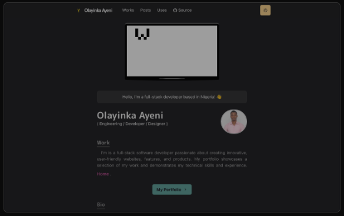

# Portfolio

> My Portfolio showcasing projects built with JavaScript, React & Redux, Ruby and Ruby on Rails.

## # Portfolio

## Stack

- HTML
- Next.js - A React framework with hybrid static & server rendering, and route pre-fetching, etc.
- Chakra UI - A simple, modular and accessible component library for React
- Three.js - 3D library for JavaScript
- Framer Motion - An animation library for React

## Live Demo

[View Portfolio](https://yinka-portfolio.vercel.app/)

## Author

👤 **Olayinka Ayeni**

- GitHub: [@YinkTech](https://github.com/yinktech)
- Twitter: [@YinkTech](https://twitter.com/yink_tech)
- LinkedIn: [Ayeni Olayinka](https://www.linkedin.com/in/yinktech/)

## 🤝 Contributing

Contributions, issues, and feature requests are welcome!

Feel free to check the [issues page](https://github.com/YinkTech/portfolio/issues).

## Show your support

Give a ⭐️ if you like this project!

## License

- MIT License.
- Acknoledge [Takuya's Homepage](https://github.com/craftzdog/craftzdog-homepage) for Knowlege and Design Inspiration
